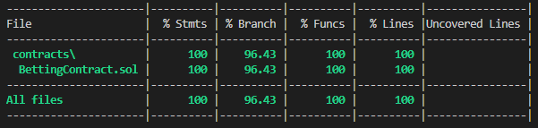

# Betting Contract

An smart contract which lets you create betting event for and let other user bet on it, and then distribute price to winners.

## Coverage


## Installation 
to install all the dependencies
```bash
npm install
```

## Explanation
1) #### Events
   - `newEvent` is emitted when new event is created
   - `newBit` is emitted when some bit on event
   - `newTeam` is emitted when some created a new team
   - `eventResult` is emitted when event is ended and result is declared by creator
 
2) #### State Variables
   - struct `bettingEventDetails` & `bettings` array is use to store betting event details
   - struct `bettorDetails` & `eventBettorsDetails` mapping is use to store bettor details when they bit on events.
   - struct `teamDetails` & `teams` array is use to store details of teams
   - mapping `hasBitted` is change when user bet on event so that it cannot bet again
   - address `owner` stores address of owner
3) ### modifiers
   - `onlyOwner` allows only owner to access that function
   - `onlyCreatorOfEvent` allows only creator of that event to access that function
   - `validEventId` check that event id is valid or not
   - `validTeamId` check that team id is valid or not
4) ### constructor
   - it store the deployers address in `owner` variable

5) ### functions
   - `getTeamName` getter function which takes in `teamId` to retrieve team name
   - `makeBet` function allows any users to bit on running betting event other than creator and owner of contract
   - `createTeam` function lets any user to create new team and will return `teamId`
   - `createBettingEvent`  function allows any one to create event to let other users bet on it when the event gets started, only owner of the contract cannot create an betting event
   - `declareResultOfEvent` function only allows creator of event to declare result of event after events gets over
   - `DistributeEventAmount`function only allows owner of the contract to distribute total amount equally to winner of the specific event
   - `calculateWinnersAndAmount` an internal function use to calculate the equal distributed amount

## Hardhat

This project demonstrates a basic Hardhat use case. It comes with a sample contract, a test for that contract, and a script that deploys that contract.

Try running some of the following tasks:

```shell
npx hardhat help // to see all the option
npx hardhat test // to run test
GAS_REPORT=true npx hardhat test // running test with gasg report
npx hardhat node // to start localnode 
npx hardhat run scripts/deploy.js // deploy contract
```

## Contributing
Pull requests are welcome. For major changes, please open an issue first to discuss what you would like to change.

Please make sure to update tests as appropriate.

## License
[MIT](https://choosealicense.com/licenses/mit/)